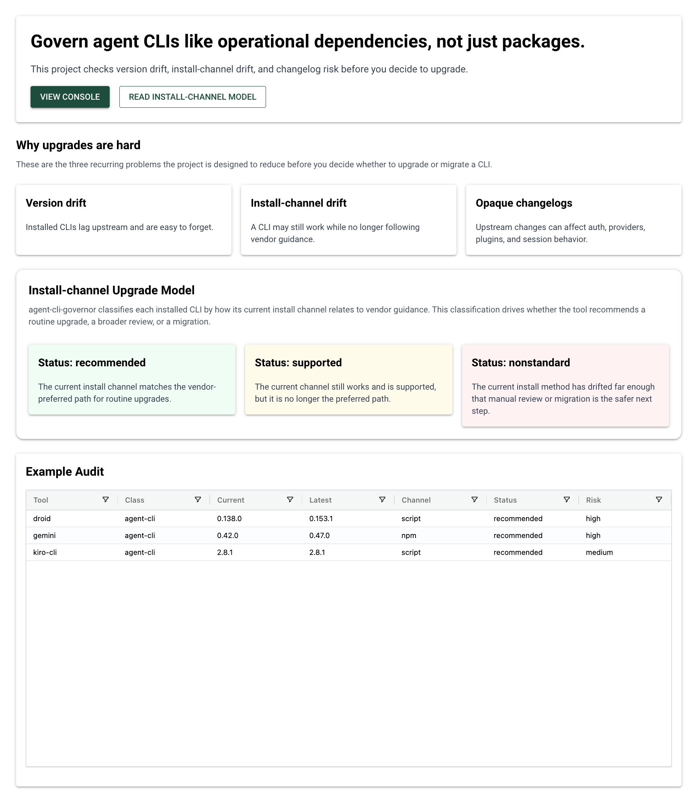
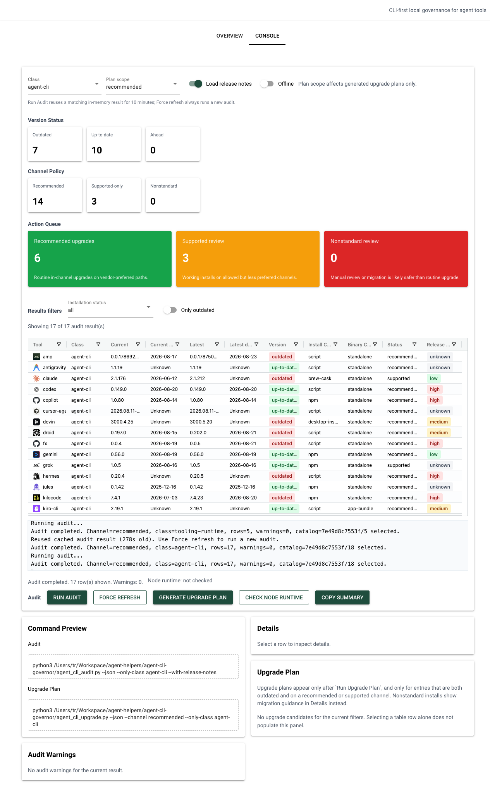

# agent-cli-governor

[English](./README.md) | [简体中文](./README.zh-CN.md)

Audit and govern locally installed agent CLIs and adjacent runtime tooling.

`agent-cli-governor` is a small local-ops repository for three related problems:

- detecting what agent CLIs are installed on a machine
- checking whether the current install channel still matches vendor guidance
- producing conservative upgrade and migration suggestions

## What It Provides

- `agent_cli_audit.py`
  Inspects installed tools, detects install channel, compares current versus latest version, summarizes release risk, and surfaces migration advice when the install method drifts from vendor guidance.
- `agent_cli_upgrade.py`
  Builds a conservative upgrade plan from the audit results and can optionally execute approved upgrades.
- `agent_cli_catalog.json`
  The policy catalog that defines tracked tools, install channels, and source-specific latest-version lookups.
- `gui.py`
  A thin NiceGUI prototype that visualizes the existing CLI and JSON outputs without replacing the CLI-first core.

## Scope

The main focus is `agent-cli` tools such as:

- OpenAI Codex CLI
- Cursor Agent CLI
- Claude Code
- Gemini CLI
- xAI Grok CLI
- Nori CLI
- Vercel fx
- Kiro CLI
- Devin CLI
- Hermes CLI
- Google Antigravity CLI (`agy`)
- Google Jules CLI
- Copilot CLI
- OpenCode
- Amp
- Droid
- Kilo Code
- Cline

Agent-operations entries currently include Multica, Claude Code Router (`ccr`), 9Router, Nowledge Mem CLI (`nmem`), Orca, and CodexBar (`codexbar`).

The catalog has three intentionally narrow classes:

- `agent-cli`: a CLI that directly accepts and runs a coding-agent task, such as Codex, Claude Code, Jules, or Gemini.
- `tooling-runtime`: protocol adapters and execution dependencies, such as ACPX, Codex ACP, Agent Browser, OpenSpec, and `uv`.
- `agent-operations`: a user-facing product that coordinates agents, routes model traffic, manages workspaces, knowledge, or usage, such as Multica, Claude Code Router, 9Router, Nowledge Mem CLI, Orca, and CodexBar.

The distinction prevents orchestration products from being mislabeled as either an Agent provider or a runtime dependency.

## Requirements

- macOS or another environment where the tracked CLIs are available in `PATH`
- Python 3
- Optional but commonly expected on the target machine:
  - `brew`
  - `npm`
  - network access for latest-version and release-note checks

The npm upgrade guard supports `mise`, `nvm`, `fnm`, and `asdf`. It validates the active Node/npm topology before an npm plan becomes executable. An unrecognized Node manager remains usable for auditing and dry-run planning, but its npm upgrades are intentionally not executable.

No Python package installation is currently required for the CLI tools.

## Usage

### Audit

```bash
python3 agent_cli_audit.py
python3 agent_cli_audit.py --offline
python3 agent_cli_audit.py --json
python3 agent_cli_audit.py --all
python3 agent_cli_audit.py --only-outdated
python3 agent_cli_audit.py --only-nonstandard
python3 agent_cli_audit.py --only-class agent-cli
python3 agent_cli_audit.py --only-class tooling-runtime
python3 agent_cli_audit.py --only-class agent-operations
python3 agent_cli_audit.py --with-release-notes
python3 agent_cli_audit.py --check-node-runtime
python3 agent_cli_audit.py --inventory-private-harnesses
python3 agent_cli_audit.py --inventory-private-harnesses --private-harness-baseline ~/private-harness-inventory.json
```

### Upgrade Planning

```bash
python3 agent_cli_upgrade.py
python3 agent_cli_upgrade.py --offline
python3 agent_cli_upgrade.py --channel recommended
python3 agent_cli_upgrade.py --channel supported
python3 agent_cli_upgrade.py --tool codex --tool gemini
python3 agent_cli_upgrade.py --tool uv --apply
```

### GUI Prototype

```bash
python3 -m pip install -r requirements-gui.txt
python3 gui.py
```

Enable NiceGUI hot reload during local GUI development:

```bash
python3 gui.py --reload
```

The GUI entrypoint is reload-safe for NiceGUI multiprocessing, so use the
command above instead of wrapping `ui.run()` behind a plain `if __name__ == "__main__":`
pattern in downstream forks.
Reload watches only this project directory's `*.py` and `*.json` files, even when
the launcher is invoked from another working directory.

The GUI is intentionally a thin shell over the existing CLI tools:

- `Overview` explains the upgrade model and shows static example data
- `Console` runs a local audit and generates a dry-run upgrade plan; it never executes upgrades
- `Load release notes` is enabled by default for online GUI audits so the Release Risk column can show available changelog evidence. Disable it for a faster version/channel-only audit; offline mode never fetches notes.
- The audit table shows a product logo, current/latest versions, and their upstream publication dates. Dates appear only when an exact GitHub release tag or npm version timestamp matches; `Unknown` means no reliable upstream date was available, never the local installation time. A compact evidence banner counts tools affected by failed upstream lookups, and hovering an `Unknown` date, latest version, or release-risk value explains whether the lookup failed or no exact upstream record matched.
- `Generate Upgrade Plan` reuses the latest matching audit result when possible, avoiding a second full network audit
- The selected CLI's `Details` panel can load release notes on demand, so changelog retrieval does not block the main audit
- `Plan scope` controls generated upgrade plans; `Installation status` and `Only outdated` are results-table filters, while the summary cards remain an unfiltered audit baseline
- `Run Audit` reuses a matching in-memory audit for up to 10 minutes; the adjacent `Force refresh` button always bypasses that cache. The cache is per GUI process and is never written to disk.
- online audit probes up to four CLIs concurrently; individual HTTP and package-manager lookups are bounded and failures appear under `Audit Warnings`
- class selection happens before probes begin, so one class cannot create warnings or network work for another; JSON output includes a catalog revision and selected-entry count for diagnostics
- local version and package-manager probes run in isolated process groups, so a timed-out launcher cannot leave a native child process behind
- Python HTTP lookups use the default `urllib` proxy resolution: `HTTP_PROXY`/`HTTPS_PROXY` take precedence, with macOS system proxy settings used when those variables are absent; that resolved proxy is also passed to `npm` and Homebrew lookups
- long-running subprocesses have a bounded timeout and are stopped on timeout rather than left running in the background
- the GUI never executes upgrades; explicit CLI `--apply` remains separately guarded and requires user authorization

Run it with `python3 gui.py`. If port `8080` is already in use, choose another port, for example `python3 gui.py --port 8081`.

### GUI Screenshot: Overview



### GUI Screenshot: Console



## Output Model

The audit output distinguishes:

- `tooling_class`
  `agent-cli`, `tooling-runtime`, or `agent-operations`
- `normalized_channel`
  For example `script`, `npm`, `brew-core`, `brew-cask`, `desktop-install`
- `binary_container`
  The resolved executable's physical form, currently `standalone` or `app-bundle`. This is distinct from install channel: an official script can install a shim in `~/.local/bin` that resolves to an app bundle.
- `channel_status`
  `recommended`, `supported`, or `nonstandard`
- `update_command`
  The one executable command selected as the safe default for `--apply`
- `upgrade_guidance`
  Structured primary-action title, rationale, installation-channel effect, and optional informational alternatives. Alternatives are never executed by `--apply`.
- `migration_command`
  A suggested migration path when the current install channel is no longer preferred
- `release_risk`
  A lightweight summary of upgrade-time change risk inferred from the latest release notes. It signals how risky or behavior-changing the newest upstream release may be to adopt, not the risk of staying on the current version.
- `audit_metadata`
  Catalog entry and selection counts plus a catalog revision, used to diagnose which policy catalog produced a GUI or JSON audit.
- `logo_url`, `current_version_published_at`, `latest_version_published_at`
  Optional presentation evidence for the product logo and exact upstream publication dates. Missing publication dates are intentionally represented as unavailable rather than as local installation times.

## Notes

- `--offline` skips network-backed latest-version checks and is better for quick local scans.
- `--check-node-runtime` is a read-only Node runtime topology check for `node`, `npm`, `npx`, and `pnpm`. It recognizes `mise`, `nvm`, `fnm`, and `asdf`; it detects PATH, Node executable, and npm-prefix drift, and applies the stricter local-wrapper policy only to `mise`. It never repairs the environment. A terminal invocation checks only that terminal; for GUI context, use the GUI's **Run Node Runtime Check** action, which launches the probe from the GUI server process.
- `--inventory-private-harnesses` is a separate, read-only inventory for private Agent Harness copies. It reports the current shell entrypoints, fixed evidence paths for Zed, Devin Desktop, Multica, Codeg, and Conductor, and explicit safe bindings for Zed, Nori, ACPX, and Codex ACP. It never recursively scans app bundles, runs host-private executables, reads command arguments or secrets, or changes a host. A private copy is a governance risk only when a client binding is confirmed and a specific policy or known risk applies; host presence alone is reported as `unconfirmed`.
- `--private-harness-baseline PATH` compares against an explicitly supplied JSON report without writing it. Use an external, private location if you choose to retain an inventory; the repository and weekly automation do not store machine inventory results. A changed baseline means manual review is warranted, not automatic repair.
- To create that external baseline deliberately, redirect the JSON output yourself, for example `python3 agent_cli_audit.py --inventory-private-harnesses --json > ~/private-harness-inventory.json`.
- The weekly upgrade automation deliberately runs only `--check-node-runtime`; it does not run the private Harness inventory or scan desktop application directories every week.
- `--only-outdated` only shows installed tools that are both outdated and upgradeable on the current channel.
- `--only-nonstandard` narrows the report to tools whose install channel does not match the vendor's supported or recommended channels.
- `--only-class` separates direct Agent CLIs, runtime dependencies, and agent-operations products.
- `--with-release-notes` fetches the latest release notes where possible and produces a simple risk summary. GitHub Releases are supported directly, and a few vendor-hosted changelog pages are summarized heuristically.
- A native self-update command is not automatically preferred over npm or Homebrew. When a CLI can explicitly preserve its install method, such as Kilo Code and OpenCode with `--method`, the plan uses that native command. When ownership effects are unverified, the plan preserves the current npm/Homebrew channel and presents native self-update only as an informational alternative.
- Claude Code uses `claude update`; its installer may migrate installation types, so it is not the default for Homebrew-managed installs. Codex script installs use the official standalone installer, while app-bundled Codex is updated with ChatGPT.app.
- Antigravity CLI uses Google's native installer at `~/.local/bin/agy` and runs its verified self-updater in the background during normal CLI use. The audit reports its official manifest version but does not treat interactive `agy` startup as an automatic `--apply` action.
- The tool catalog lives in `agent_cli_catalog.json`.
- Most entries are `agent-cli`. `tooling-runtime` covers supporting adapters and dependencies; `agent-operations` covers products that coordinate one or more Agent CLIs without being the Agent itself.
- The audit output separates the selected `update_command` from `migration_command`. `upgrade_guidance` explains which action is selected, how it affects installation ownership, and when an alternative is only for review or troubleshooting.
- `agent_cli_upgrade.py` only upgrades entries that are both outdated and on a recognized supported or recommended channel.
- npm-channel plans run through the validated Node runtime provider: `mise` uses `mise exec node -- npm`, while `nvm`, `fnm`, and `asdf` use a path-bound npm command with the validated Node bin directory first in `PATH`. A failed or unsupported runtime check leaves dry runs visible but blocks `--apply` for plans containing npm-channel upgrades.
- Source-linked catalog entries, currently including 9Router and Claude Code Router, can read a compatible local launcher and report the existing local Git relation to their configured upstream ref. They never fetch, rebase, or modify the checkout; a stale upstream ref is explicitly reported.
- Missing catalog entries are omitted from the default audit and listed only with `--all`.
- `agent_cli_upgrade.py --offline` reuses offline audit mode for faster but less complete upgrade planning.
- `agent_cli_upgrade.py --only-class agent-cli` limits planning to the same class boundary used by the audit.
- `agent_cli_upgrade.py --channel recommended` narrows the plan to vendor-recommended install channels only.
- `agent_cli_upgrade.py --channel supported` is the default and includes both recommended and supported channels.
- `--recommended-only` is kept as a compatibility alias for `--channel recommended`.

## Why Not `topgrade`

`topgrade` is useful as a bulk execution engine, but this repository solves a different problem.

`agent-cli-governor` is opinionated about:

- whether a tool is installed through the vendor-recommended channel
- whether the current channel is merely supported or already drifted
- how to compare vendor-specific latest-version sources
- how to surface migration advice when the install method is no longer preferred

Those policy checks are the core value here. A generic upgrader can execute package-manager updates, but it usually does not answer:

- should this tool be upgraded from the current channel at all
- is the current install method still the one the vendor wants
- does this tool need an in-channel upgrade or a migration

So the project treats `topgrade` as optional execution infrastructure, not as the decision-making layer.

## Why `recommended` vs `supported`

The distinction is intentional and operationally useful:

- `recommended`
  The vendor's current preferred installation path. This is the safest default for routine upgrades.
- `supported`
  A channel the vendor still supports, but does not currently present as the preferred path.

Without this distinction, local CLI governance becomes too coarse:

- some tools would be upgraded through channels the vendor is gradually de-emphasizing
- migration opportunities would be hidden inside normal upgrade advice
- automated checks could not separate "safe default upgrades" from "allowed but less preferred upgrades"

In practice:

- `--channel recommended` is the conservative weekly-upgrade path
- `--channel supported` is the broader review path
- `nonstandard` is where migration or manual review is usually needed

## Repository Development

Basic health checks:

```bash
python3 -m py_compile agent_cli_audit.py agent_cli_upgrade.py gui.py
python3 agent_cli_audit.py --offline --only-class agent-cli
python3 agent_cli_upgrade.py --channel recommended
```

## License

MIT. See [LICENSE](./LICENSE).
